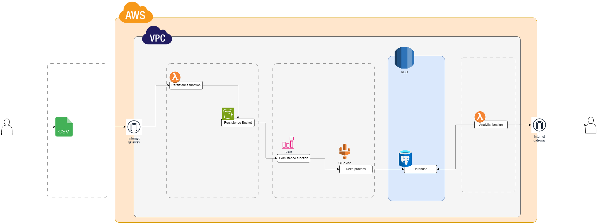
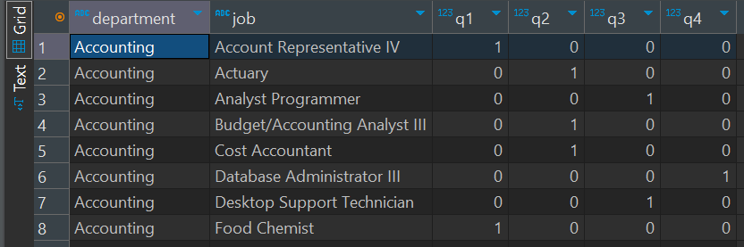
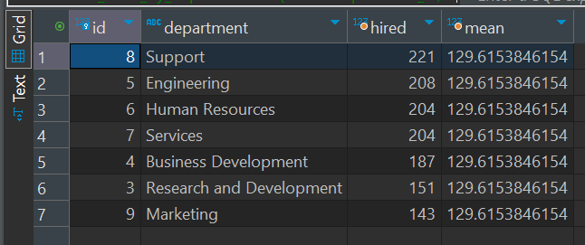

# CSV File Ingestion [CFI]

The CFI project is a data project that has csv files as source, the files are processed by the pipelines and stored incrementaly in our Postgres database.

Elements descriptions:
- csv_file_persistence, receive a POST http request with a file, the file can be a base64 or a octstream file. Using multipart this function can handle large files receiving them by parts. The file is stored as csv and parquet using polars library.
  - the layers with the libraries for this lambda are being created with Docker.
- persistence bucket, stores the csv and parquets used by this pipeline.
- event, s3 triggers an event to trigger a lambda that triggers a glue job.
- csv process, this glue job creates a dataframe with all the delta data (incremental data) and inserts to the database only new rows (UPSERT).
- postgres, database with 3 tables (departments, jobs, hired_employees)
  - The connection from a local machine is allowed (Using DBeaver in my case)




## Deploying the project in AWS

All the infraestructure uses terraform to define all the resources and the respective relations.

1. Set the AWS credential keys.
```bash
export AWS_ACCESS_KEY_ID="ASDASDASDASDASDASD"
export AWS_SECRET_ACCESS_KEY="Bebebebebe+UYTUYTUYTYUTUTYUTYUYUYT"
```
2. Terraform init.
```bash
terraform init
```
3. Terraform plan. Validate and describe all the resources that will be deployed.
```bash
terraform plan
```
4. Terraform deploy. Deploy the resources in AWS. Virginia is being use as region. The output would be something like the code below.
```bash
terraform deploy
```
```bash
Apply complete! Resources: X added, X changed, X destroyed.

Outputs:

api_url = "https://api_id.execute-api.us-east-1.amazonaws.com/dev"
glue_job_name = "csv_processor"
lambda_arn = "arn:aws:lambda:us-east-1:123456789:function:csv_ingest"
rds_endpoint = "terraform-00000001.abcdfghijklmnopq.us-east-1.rds.amazonaws.com:5432"
vpc_id = "vpc-0123456789abcdef"
```

# Ingesting the files

Example of the files ingestions.
```bash
curl -X POST https://api_id.execute-api.us-east-1.amazonaws.com/prod/csv -F "file=@/home/ubuntu/work/departments.csv"
```
```bash
curl -X POST https://api_id.execute-api.us-east-1.amazonaws.com/prod/csv -F "file=@/home/ubuntu/work/jobs.csv"
```
```bash
curl -X POST https://api_id.execute-api.us-east-1.amazonaws.com/prod/csv -F "file=@/home/ubuntu/work/hired_employee.csv"
```

# Generating the reports

Connect to the database rds_endpoint output.

The DDLS and reports are in this repo `database/*`
- First report
  


- Second report




Useful links:
https://kludex.github.io/python-multipart/quickstart.html#simple-example